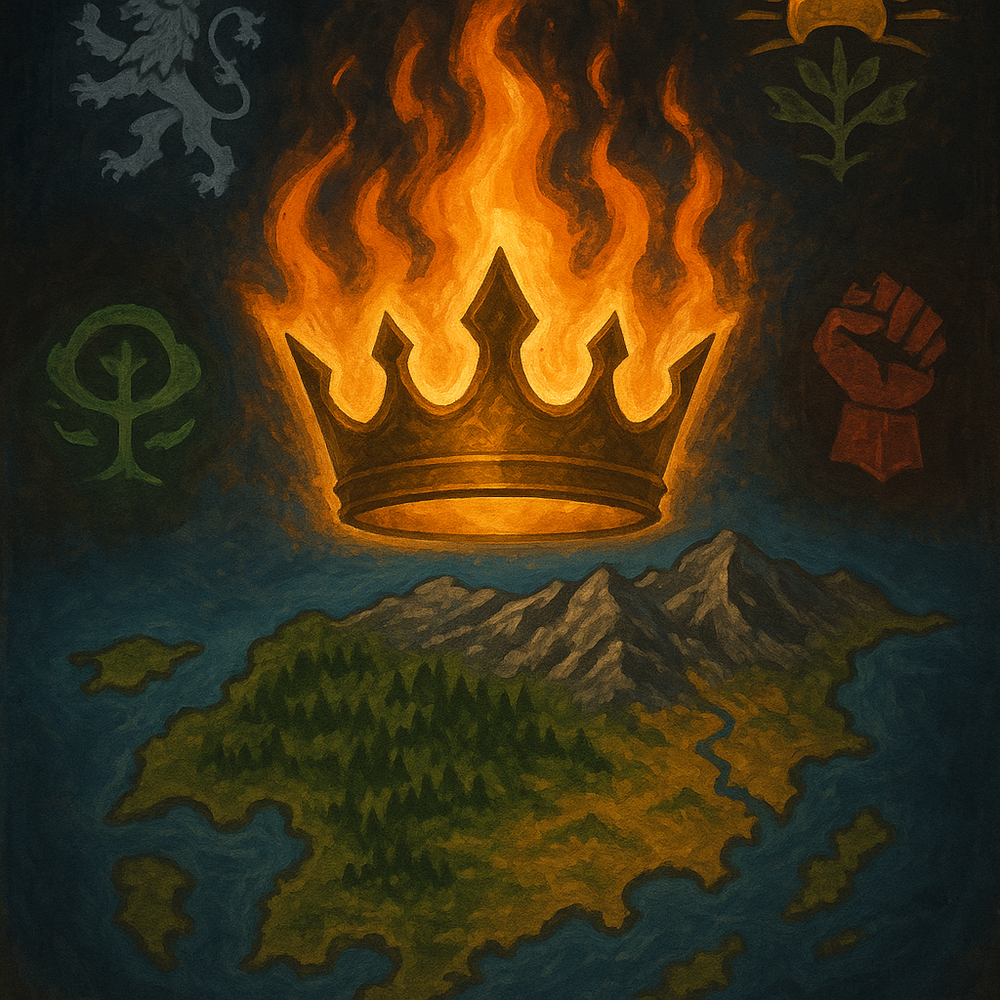

# AI Civ
Files to create a chatbot simulation where you rule a medieval fantasy kingdom trying to unify an island

## Contents

### core_prompt.txt:
This file contains the main prompt that controls the overall behavior/flow of the chat bot and tells it how to run the game.

### Knowledge Files

***Required***

**Aerthos_Countries.txt**: Contains world information about Aerthos, including scale, a simple grid map, the 4 countries on the island, territory, starting states for all countries, and major locations and troop dispositions etc..

**Game_Mechanics.txt**: Logic-based information regarding core aspects of the game for the AI. Things like how the grid map is structured, standardized military unit codes (to quickly assess the type and quality of different units), NPC character card templates, and so on.

***Optional***

**Aerthos_NPCs.txt**: This file contains a working list of already-generated NPC character cards to exist in the world. It is not necessary to run the game, but just adds consistency between runs and saves on some context by not needing to generate new NPCs in chat. Without the file, the AI will just generate new NPC templates on the fly.

You can also create and upload your own copy of `Aerthos_NPCs.txt` to manage your own working list of NPCs by copying the character cards to file when they're generated.

*Caveat: Unless you link to a Google Doc or similar, you'll need to re-upload the NPC file. Also depends on which interface you use to run the bot*

### Maps

**aerthos_map.html**: Simplistic, AI Generated semi-interactive map of the island. Not very detailed, but gives a decent sense of where things are geographically. You'll 
## Helpful Tips

**Google Docs** - At least with Gemini, if you upload the files via Google Drive, the Gem will automatically update whenever you update the Google Doc. This is very useful for making minor changes or keeping a running log of NPC character cards

## Setup - Google Gemini

**Clone Repo** - Clone or download the files from this repo to your local computer so you can then upload them to Gemin

**Create Gem** - First step is to navigate to create a new Gem from the Gemini chat UI. The option is in the expanded menu on the left side

**Core Prompt** - Copy the contents of the `core_prompt.txt` file into the main prompt section of the newly created Gem. 

**Knowledge Files** - Next, at a minimum, upload the `Aerthos_Countries.txt` and `Game_Mechanics.txt` files as knowledge files for the Gem. 

Additionally, add the `Aerthos_NPCs.txt` file if you want to have the already-defined characters contained within it added to your game. Or create your own, as mentioned.

## Setup - ChatGPT

**Create GPT** - First step is go to the 'GPTs' option at the top left of the UI, then click the create button up at the top right.

**Add Prompt and Files** After that, it's essentially the same as the Gem process, but with a few extra options like a thumbnail.

***[Link to Existing GPT for Aerthos](https://chatgpt.com/g/g-683f2f84d3f88191b6b4bc73c6a0c7d8-aerthos-unification)***
